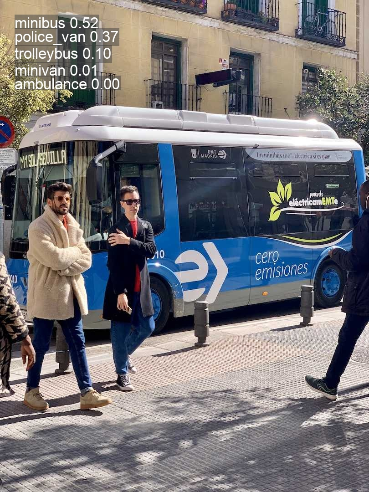
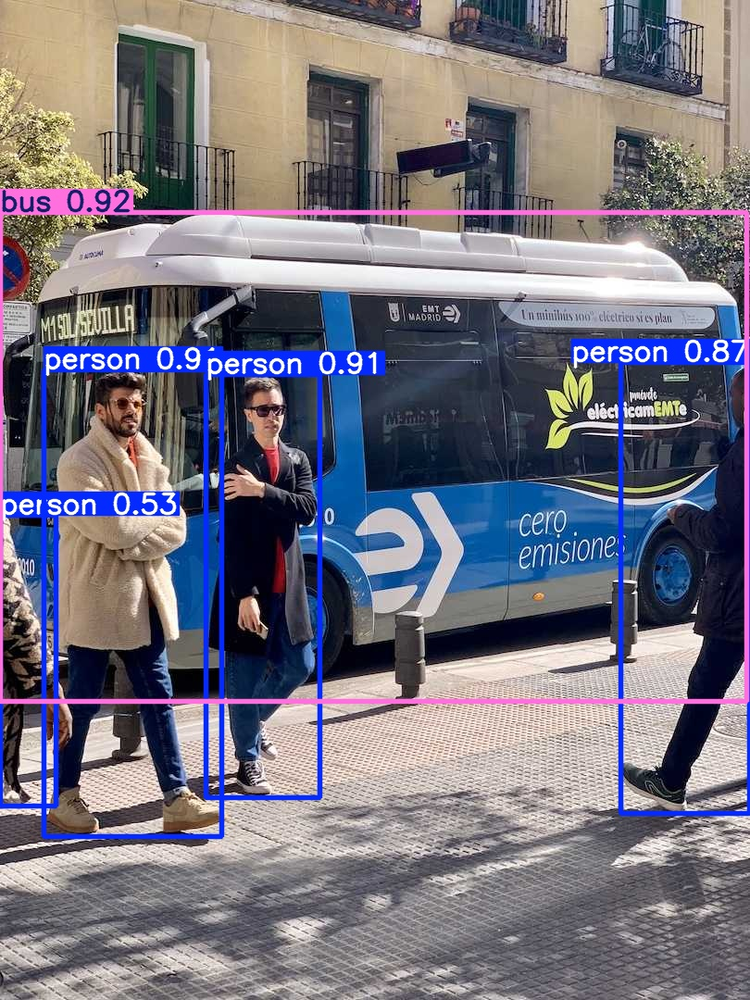
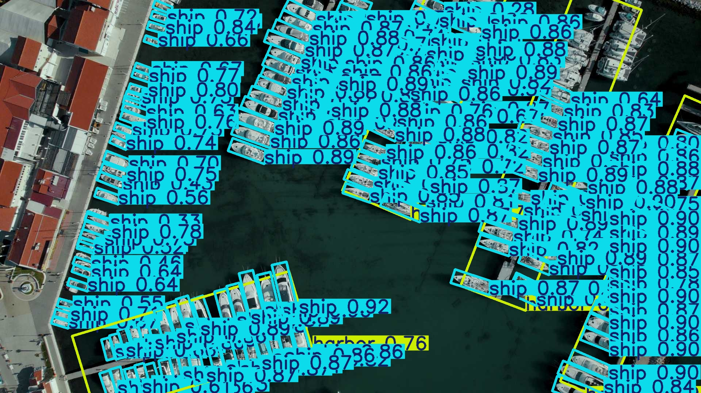
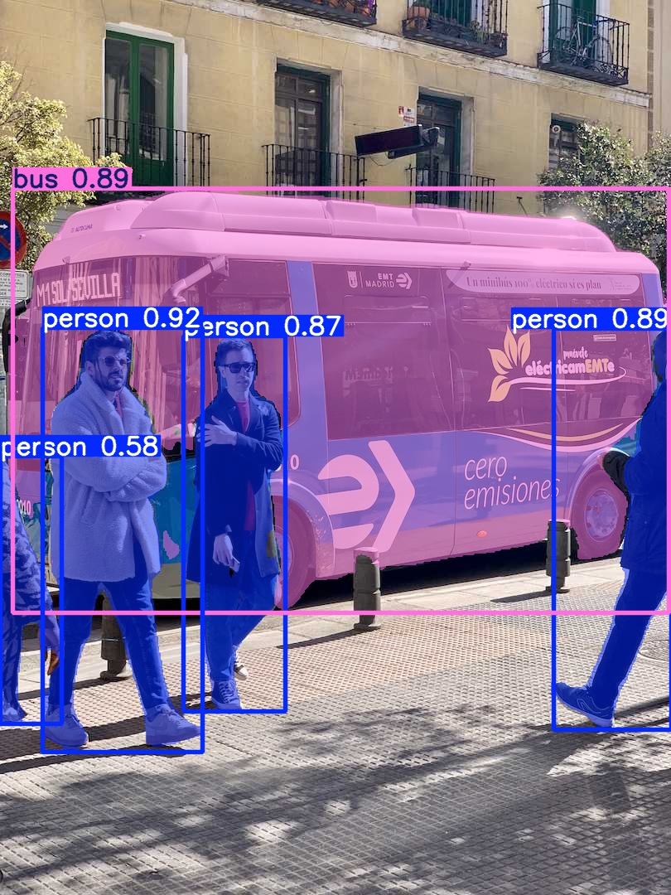
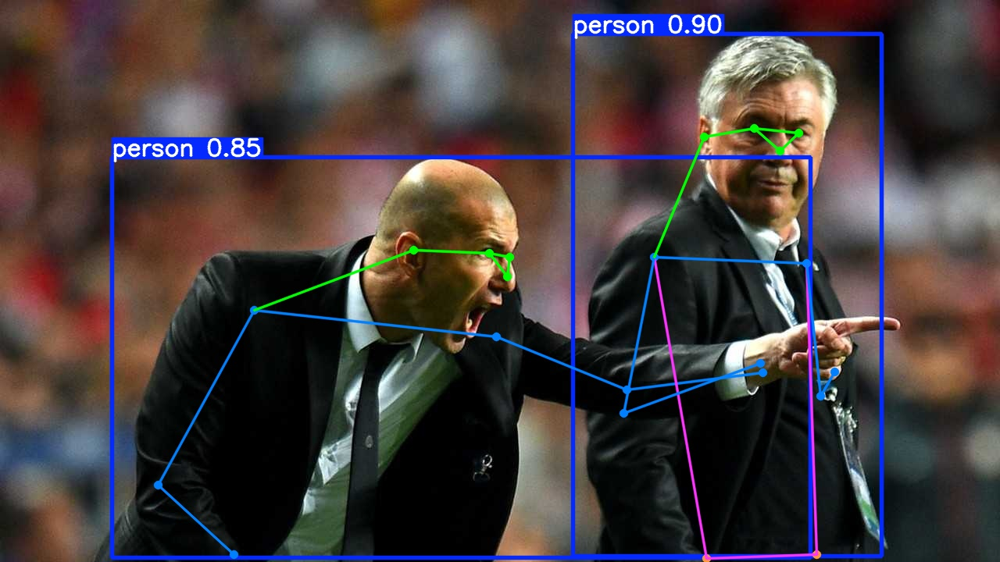

# YOLO Course

A hands-on, script-first course that demonstrates how to use **Ultralytics YOLO** models for five core computer vision tasks:

1. Image classification
2. Object detection
3. Oriented object detection (OBB)
4. Instance segmentation
5. Human pose estimation

Each lesson lives in a focused Python script under `scripts/` so students can read, run, and modify the workflow in one place.

## Supported YOLO Versions

The scripts are compatible with Ultralytics YOLO releases that share the same Python API, including:

- YOLO26 (default models in this repo)
- YOLO11
- YOLOv8

To switch versions, swap the `--model` checkpoint in each script to the desired model name.

## Repository Layout

```
.
├── README.md
├── requirements.txt
├── scripts
│   ├── classify
│   │   └── classify.py
│   ├── detect
│   │   └── detect.py
│   ├── oriented_detect
│   │   └── oriented_detect.py
│   ├── pose
│   │   └── pose.py
│   └── segment
│       └── segment.py
└── .gitignore
```

## Prerequisites

- Python 3.9+
- macOS, Linux, or Windows

## Setup

```bash
conda create -n yolo26 python=3.10
conda activate yolo26
python -m pip install --upgrade pip
python -m pip install -r requirements.txt
```

> Note: `ultralytics` depends on PyTorch. Pip will install a CPU build of PyTorch by
> default. For GPU acceleration, install a CUDA-enabled PyTorch build first from
> https://pytorch.org/get-started/locally/ and then install `ultralytics`.

## Quickstart

### 1) Image Classification

```bash
python scripts/classify/classify.py \
  --source images/bus.jpg
```



### 2) Object Detection

```bash
python scripts/detect/detect.py \
  --source images/bus.jpg
```



### 3) Oriented Object Detection (OBB)

```bash
python scripts/oriented_detect/oriented_detect.py \
  --source images/boats.jpg
```



### 4) Instance Segmentation

```bash
python scripts/segment/segment.py \
  --source images/bus.jpg
```



### 5) Human Pose Estimation

```bash
python scripts/pose/pose.py \
  --source images/zidane.jpg
```



By default, outputs are saved under `runs/` with task-specific subfolders. You can customize the model, confidence threshold, device, and output location using CLI flags in each script.

## Notes on Default Models

The scripts default to YOLO26 nano checkpoints for fast execution:

- Classification: `yolo26n-cls.pt`
- Detection: `yolo26n.pt`
- Oriented detection: `yolo26n-obb.pt`
- Segmentation: `yolo26n-seg.pt`
- Pose estimation: `yolo26n-pose.pt`

You can swap in `s`, `m`, `l`, or `x` versions for higher accuracy.

## Next Steps for the Course

- Add dataset-driven training notebooks for each task.
- Include evaluation scripts and metrics visualizations.
- Add export demos (ONNX, CoreML, TensorRT) for deployment.

---

Built with Ultralytics YOLO models (YOLO26 defaults): https://docs.ultralytics.com/models/yolo26/
